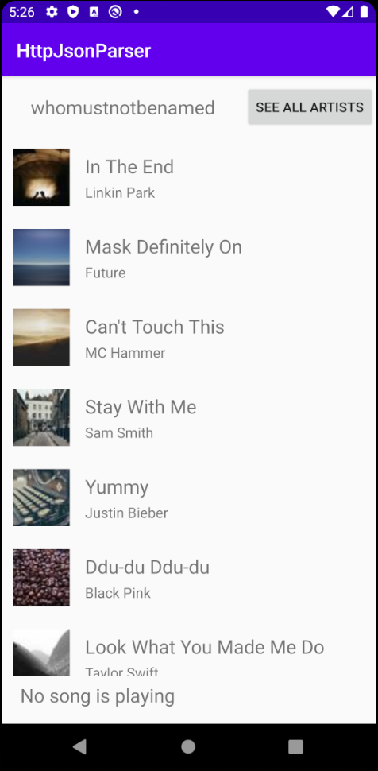

# HttpJsonParser by Sean Yang

This app is a music player which fetches data from remote api.  
A user can select a song from a list and play it.  
When playing a song a user can access the now playing section

## Screenshots

